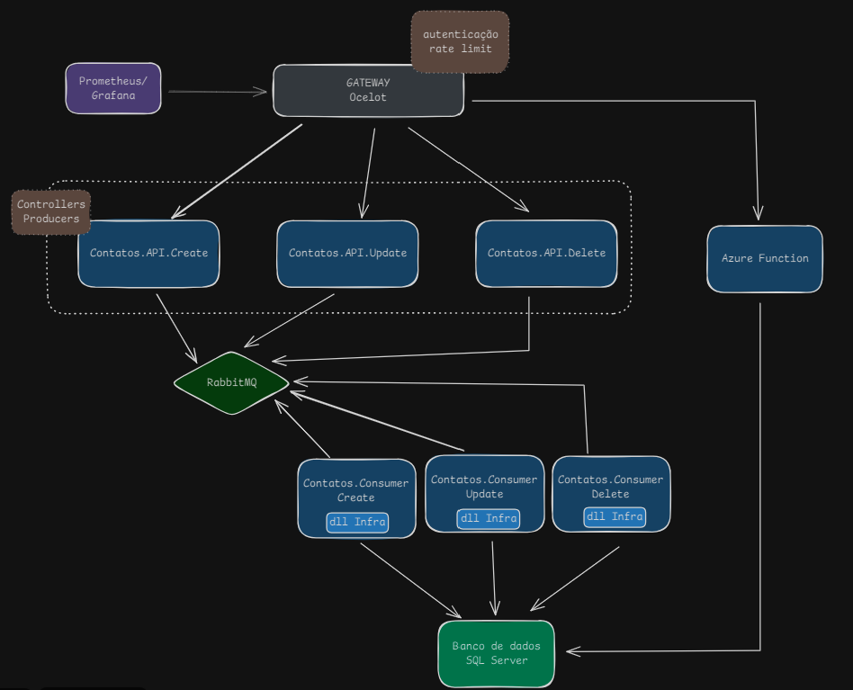

# API de Gerenciamento de Contatos

Este repositório contem um conjunto de aplicações que propõem solucionar o Tech Challenge da Fase 3 do curso de pós graduação 6NETT na FIAP.

Na imagem abaixo é ilustrada a arquitetura utilizada para orquestrar as aplicações:


## teste

## Índice
- [Pré-requisitos](#pré-requisitos)
- [Configuração do Projeto](#configuração-do-projeto)
- [Endpoints da API](#endpoints-da-api)
  - [Autenticação e Registro de Usuários](#autenticação-e-registro-de-usuários)
  - [Gerenciamento de Contatos](#gerenciamento-de-contatos)
- [Uso da API](#uso-da-api)
  - [Exemplos de Requisições](#exemplos-de-requisições)
- [Configuração do Monitoramento](#configuração-do-monitoramento-com-prometheus-e-grafana)
- [Testes](#testes)
- [Tecnologias Utilizadas](#tecnologias-utilizadas)

## Pré-requisitos

- [Docker](https://www.docker.com/get-started/) e [Docker Compose](https://docs.docker.com/compose/install/) (necessário para executar o projeto)
- [.NET SDK 8.0](https://dotnet.microsoft.com/download/dotnet/8.0) (somente para executar local)
- [SQLite](https://www.sqlite.org/index.html) (somente para executar local)
- [Postman](https://www.postman.com/) (opcional, para testar a API)

## Configuração do Projeto

**1. Clone o repositório:**

   ```bash
   git clone https://github.com/Grupo-1-6NETT/fiap6-net-microsservicos-f3.git   
   ```


**2. Inicie todos os serviços (API, Prometheus, Grafana, Node Exporter):**

```bash
docker-compose up --build
```

Após iniciar, o gateway estará disponível em:

- API: http://localhost:5000 (porta padrão)
- Prometheus: http://localhost:9090
- Grafana: http://localhost:3000

---
## Endpoints da API
### Autenticação e Registro de Usuários
|Método|Endpoint|Descrição|
|---|---|---|
|GET|/Token|Gera um token de autenticação para o usuário e senha informados|
|POST|/Usuario|Adiciona um Usuário na base de dados|

### Gerenciamento de Contatos
|Método|Endpoint|Descrição|
|---|---|---|
|GET|/Contatos|Lista os Contatos cadastrados, ordenados por nome, que correspondem aos parâmetros informados|
|POST|/AdicionarContato|Adiciona um Contato na base de dados|
|PATCH|/AtualizarContato|Atualiza um Contato na base de dados|
|DELETE|/RemoverContato/{id}|Remove o contato na base de dados com o ID informado|

## Uso da API
Para acessar os endpoints, você precisará autenticar o usuário e incluir o token JWT no cabeçalho das requisições aos endpoints protegidos.

### Exemplos de Requisições
**1. Registrar um Novo Usuário**
**Endpoint**: POST /Usuario

**Corpo da Requisição:**

```json
{
  "nome": "novo_usuario",  
  "senha": "SuaSenha123",
  "permissao": "admin"
}
```

**2. Gerar Token**
**Endpoint**: GET /token

**Corpo da Requisição:**

```json
{
  "usuario": "novo_usuario",
  "senha": "SuaSenha123"
}
```

**Resposta:**
```json
 "eyJhbGciOiJIUzI1NiIsInR5..."
```

**3. Criar um Novo Contato**
**Endpoint**: POST /contatos

**Cabeçalho**: `Authorization: Bearer {seu_token_jwt}`

**Corpo da Requisição:**

```json
{
  "nome": "Maria Souza",
  "telefone": "99999-9999",
  "ddd": "11",
  "email": "maria.souza@example.com"
}
```
---
## Configuração do Monitoramento com Prometheus e Grafana
A API já está configurada para expor métricas no endpoint `/metrics`

Após acessar o Grafana (http://localhost:3000), siga os passos abaixo:

1. Configure o Prometheus como fonte de dados.
2. Importe dashboards pré-configurados para métricas de API e sistema.

---
## Testes
Para executar os testes, e para cada solução no repositório, use o comando:

```bash
dotnet test
```

Os testes de unidade foram implementados utilizando o Moq e FluentAssertions para validações.

---
## Tecnologias Utilizadas
- **ASP.NET Core 8** - Framework principal para desenvolvimento da API
- **Entity Framework Core** - ORM para manipulação do banco de dados
- **JWT** - JSON Web Token para autenticação
- **Swagger** - Documentação interativa da API
- **RabbitMQ** - Message Broker
- **MassTransit** - Transporte de mensagens
- **Azure SQL Database** - Banco de dados
- **Moq e FluentAssertions** - Testes unitários
- **Prometheus e Grafana** - Monitoramento e visualização de métricas.
- **Node Exporter** - Coleta de métricas de hardware e sistema.
- **Azure Function** - Para obtenção dos dados de contato.
- **Ocelot** - API Gateway
